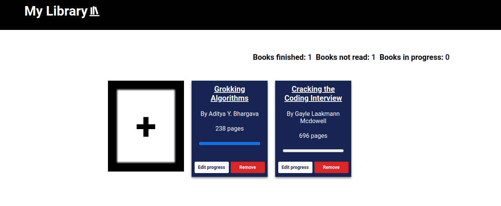

# Library
Live demo &#128073; https://masecurity.github.io/Library/
## What is this project about?
The Library project allows users to keep a record of books, that they intend to read or have already read, user's also have the abillity to remove or update the
reading status of the book. This project was built using HTML, CSS and JavaScript.

## What i learned
- Objects and constructors
- DOM manipulation
